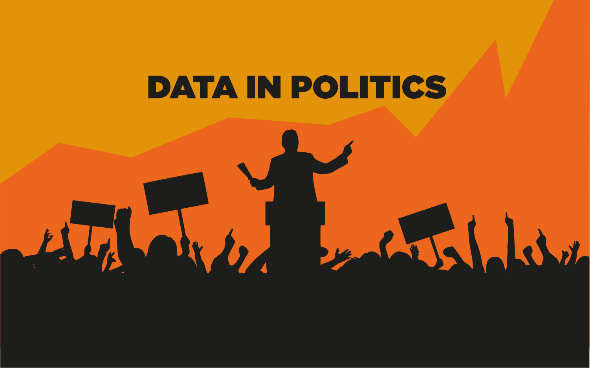

# Big Data and Political Science

## Authors 
* X. Y.
* W. A.
* ...

## Summary
The article treats the impact of big data in political sciences. We start by a synthesis of recent scientific articles published relative to this subject. Starting from how big data is used in political elections, we also talk about how big data influenced sociological research in general, what benefits it brought about and what are the opportunities and the limits of big data use in political science in Chapter 1 and 3. Also, we give an exemple of data use case in US politics. Then, big data's impact on geopolitics is discussed in Chapter 2. Chapter 4 raises some ethical issues. Whereas Chapter 5 explains how big data influence political compaigns.

## Contents 
- Chapter 1 : Recent scientific insights
	- [1-0](methodology.md) Systematic Literature Review
	- [1-1](chapter1_1.md) Big data in sociological research / Big data in political elections 
	- [1-2](chapter1_2.md) Big data in public affairs / Big data and policy making
	- [1-3](chapter1_3.md) Social Media Data in US politics
- [Chapter 2](chapter2.md) : Big data and geopolitics
- [Chapter 3](chapter3.md) : Big data and sociological research
- [Chapter 4](chapter4.md) : Big data in political sciences and ethics
- [Chapter 5](chapter5.md) : Big data and election compaigns
- [Bibliography](bibliography.md) 

